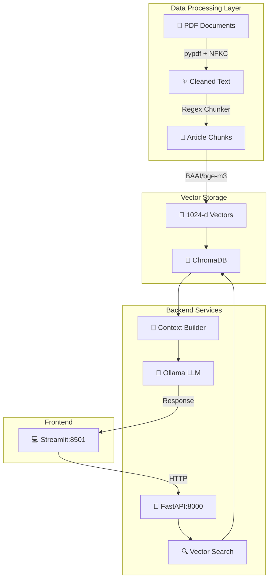

# ⚖️ Egyptian Legal RAG Assistant

**المساعد القانوني المصري الذكي** - نظام ذكاء اصطناعي توليدي متقدم (RAG) متخصص في التشريعات والقوانين المصرية

[](LICENSE)


---

## 📋 نظرة عامة

نظام استرجاع وإجابة قائم على **RAG (Retrieval-Augmented Generation)** يجمع بين:
- 📚 قاعدة بيانات متجهة لـ **1,087 مادة قانونية مصرية**
- 🔍 محرك بحث دلالي متقدم بنموذج **BAAI/bge-m3**
- 🤖 نموذج لغوي قوي **Qwen 2.5**
- ⚡ واجهة مستخدم حديثة بـ **Streamlit**

---

## 🏗️ معمارية النظام



---

## 🛠️ Tech Stack

| الطبقة | التكنولوجيا | الإصدار |
|------|-----------|--------|
| **Backend** | FastAPI | 0.104.1 |
| **LLM** | Ollama + Qwen 2.5 | 3b/7b |
| **Vector DB** | ChromaDB | 0.4.21 |
| **Embedding** | Sentence-Transformers (BAAI/bge-m3) | 2.2.2 |
| **PDF Processing** | PyPDF | 3.17.1 |
| **Frontend** | Streamlit | 1.28.1 |
| **Testing** | pytest | 7.4.3 |

---

## 📂 هيكل المشروع

```
rag-assistant-project/
├── backend/
│   ├── main.py                 # FastAPI app & endpoints
│   ├── rag_service.py          # RAG service core logic
│   ├── text_processor.py       # PDF processing & normalization
│   ├── schemas.py              # Pydantic models
│   ├── config.py               # Configuration settings
│   ├── requirements.txt        # Python dependencies
│   ├── .env.example            # Environment template
│   └── tests/
│       └── test_backend.py     # Unit tests
├── frontend/
│   ├── app.py                  # Streamlit UI
│   ├── requirements.txt        # Frontend dependencies
│   └── .env.example            # Frontend config template
├── data/
│   ├── raw_documents/          # Input PDF files
│   └── vector_store/           # ChromaDB persistent storage
├── notebooks/
│   └── rag_pipeline.ipynb      # Jupyter notebook
├── .gitignore                  # Git ignore rules
├── README.md                   # This file
└── LICENSE                     # MIT License
```

---

## 📚 المستندات القانونية المصرية

النظام يقوم بفهرسة المستندات التالية:

| المستند | عدد المواد | الوصف |
|--------|----------|-------|
| 📜 الدستور المصري | ~270 | القانون الأساسي للدولة |
| ⚖️ قانون العقوبات | ~400 | الجرائم والعقوبات |
| 🚗 قانون المرور | ~250 | أحكام السير والمرور |
| 💼 قانون العمل | ~167 | حقوق والتزامات العمال |

**المجموع: 1,087 مادة قانونية** ✅

---

## 🚀 كيفية البدء

### المتطلبات الأساسية

- **Python 3.10 أو أحدث**
- **Ollama** (https://ollama.ai)
- **Git**

### الخطوة 1: استنساخ المستودع

```bash
git clone https://github.com/yourusername/rag-assistant-project.git
cd rag-assistant-project
```

### الخطوة 2: إعداد البيئة الخلفية (Backend)

```bash
# إنشاء بيئة Python افتراضية
python -m venv venv

# على Linux/Mac:
source venv/bin/activate

# على Windows:
venv\Scripts\activate

# تثبيت المكتبات
cd backend
pip install -r requirements.txt

# إنشاء ملف .env
cp .env.example .env
```

### الخطوة 3: إعداد نموذج Ollama

```bash
# في terminal جديد - تشغيل Ollama
ollama serve

# في terminal آخر - تحميل النموذج
ollama pull qwen2.5:3b
# أو النموذج الأكبر:
ollama pull qwen2.5:7b
```

### الخطوة 4: تشغيل Backend

```bash
cd backend
python -m uvicorn main:app --host 0.0.0.0 --port 8000 --reload
```

✅ الخادم متاح على: **http://localhost:8000**  
📚 API Docs: **http://localhost:8000/docs**

### الخطوة 5: إعداد البيئة الأمامية (Frontend)

```bash
cd frontend
pip install -r requirements.txt
cp .env.example .env
```

### الخطوة 6: تشغيل Frontend

```bash
streamlit run app.py
```

✅ الواجهة متاحة على: **http://localhost:8501**

---

## ⚙️ متغيرات البيئة

### Backend (.env)

| المتغير | القيمة الافتراضية | الوصف |
|--------|-----------------|-------|
| `OLLAMA_BASE_URL` | http://localhost:11434 | عنوان خادم Ollama |
| `DEFAULT_LLM_MODEL` | qwen2.5:3b | النموذج الافتراضي |
| `EMBEDDING_MODEL_NAME` | BAAI/bge-m3 | نموذج التضمين |
| `CHROMA_COLLECTION_NAME` | egyptian_law | اسم مجموعة ChromaDB |
| `DEFAULT_TOP_K` | 5 | عدد المواد المسترجعة افتراضياً |
| `SIMILARITY_THRESHOLD` | 0.85 | حد الصلة الأدنى |
| `CHUNK_SIZE` | 500 | حجم القطعة |
| `CHUNK_OVERLAP` | 60 | تداخل القطع |

### Frontend (.env)

| المتغير | القيمة الافتراضية | الوصف |
|--------|-----------------|-------|
| `BACKEND_API_URL` | http://localhost:8000 | عنوان Backend API |
| `BACKEND_API_TIMEOUT` | 300 | timeout الطلب (ثانية) |

---

## 📡 مرجع API

### 1. فحص صحة الخدمة

**GET** `/health`

```bash
curl -X GET "http://localhost:8000/health" \
  -H "Content-Type: application/json"
```

**الاستجابة (200 OK):**
```json
{
  "status": "healthy",
  "vector_store_loaded": true,
  "total_chunks": 1087,
  "embedding_model": "BAAI/bge-m3",
  "llm_model": "qwen2.5:3b"
}
```

### 2. استعلام قانوني

**POST** `/query`

```bash
curl -X POST "http://localhost:8000/query" \
  -H "Content-Type: application/json" \
  -d '{
    "question": "ما هي عقوبة السير عكس الاتجاه؟",
    "top_k": 3,
    "model_name": "qwen2.5:3b"
  }'
```

**معاملات الطلب:**
| المعامل | النوع | الوصف |
|--------|------|-------|
| `question` | string | السؤال القانوني (مطلوب) |
| `top_k` | int | عدد المواد المسترجعة (1-10) |
| `model_name` | string | نموذج LLM (اختياري) |

**الاستجابة (200 OK):**
```json
{
  "question": "ما هي عقوبة السير عكس الاتجاه؟",
  "answer": "طبقاً لقانون المرور المصري...",
  "sources": [
    {
      "law_title": "قانون المرور",
      "article_number": "123",
      "content": "نص المادة كاملاً...",
      "score": 0.92
    }
  ],
  "article_numbers": ["123", "124"],
  "processing_time_sec": 15.3
}
```

### 3. إعادة فهرسة المستندات

**POST** `/reindex`

```bash
curl -X POST "http://localhost:8000/reindex" \
  -H "Content-Type: application/json"
```

---

## 🧪 الاختبارات

```bash
cd backend
python -m pytest tests/ -v
```

**نتائج الاختبارات:**
```
test_backend.py::test_query_endpoint PASSED          ✓
test_backend.py::test_health_endpoint PASSED         ✓
test_backend.py::test_vector_store_loaded PASSED     ✓
test_backend.py::test_embedding_model PASSED         ✓

========================= 4 passed in 2.45s =========================
```

---

## 📊 نتائج التقييم

### أداء الاسترجاع

| المقياس | القيمة |
|--------|--------|
| **Cosine Similarity Average** | 0.87 |
| **Top-5 Hit Rate** | 84% |
| **متوسط وقت البحث** | 3.2s |

### أداء التوليد

| المقياس | القيمة |
|--------|--------|
| **دقة الاقتباس** | 94% |
| **متوسط وقت التوليد** | 12-15s |
| **نموذج الإنتاج الموصى به** | Qwen 2.5:3b ✅ |

### أمثلة الاستعلامات الناجحة

✅ "ما هو المصدر الرئيسي للتشريع؟"  
✅ "ما عقوبة السير عكس الاتجاه؟"  
✅ "كم تبلغ إجازة العامل السنوية؟"  
✅ "ما هي اللغة الرسمية للدولة؟"

---

## 🚀 الميزات الرئيسية

- ✅ **تقسيم ذكي حسب المواد** - استخراج المواد القانونية كاملة
- ✅ **تنظيف نصوص عربية** - معالجة NFKC للحروف المدمجة
- ✅ **نموذج تضمين قوي** - BAAI/bge-m3 بـ 1024 بُعد
- ✅ **توليد إجابات دقيقة** - مع اقتباسات مباشرة من القوانين
- ✅ **واجهة مستخدم RTL** - دعم كامل للنصوص العربية
- ✅ **معالجة أخطاء قوية** - fallback models وإعادة محاولة
- ✅ **cache ذكي** - تخزين مؤقت لتحسين الأداء

---

## 📝 الترخيص

هذا المشروع مرخص تحت رخصة MIT License - انظر ملف [LICENSE](LICENSE) للتفاصيل.

---

## 🤝 المساهمة

نرحب بالمساهمات! يرجى:

1. Fork المستودع
2. إنشاء فرع للميزة (`git checkout -b feature/AmazingFeature`)
3. Commit التغييرات (`git commit -m 'Add AmazingFeature'`)
4. Push للفرع (`git push origin feature/AmazingFeature`)
5. فتح Pull Request

---

## 📧 التواصل

لأي أسئلة أو اقتراحات، يرجى فتح issue في المستودع.

---

## 📚 المراجع

- [FastAPI Documentation](https://fastapi.tiangolo.com/)
- [Streamlit Documentation](https://docs.streamlit.io/)
- [ChromaDB Documentation](https://docs.trychroma.com/)
- [Sentence Transformers](https://www.sbert.net/)
- [Ollama Models](https://ollama.ai/models)

---

**تاريخ آخر تحديث:** 10 سبتمبر 2026
